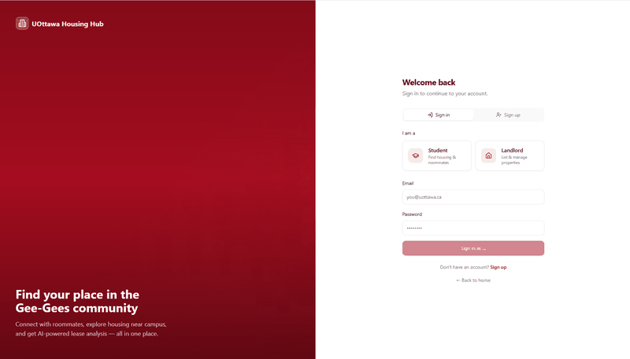

# uOttawa Housing Hub

A housing platform for University of Ottawa students. Connect with compatible roommates, explore nearby apartments on an interactive map, and get AI-powered lease analysis — all in one place.

## Screenshots



## Features

- **Roommate Matcher** — Swipe through compatible profiles based on lifestyle, budget, and preferences
- **Interactive Housing Map** — Explore apartments near campus with Mapbox; filter by price, bedrooms, and distance
- **AI Lease Checker** — Upload PDF/DOC/DOCX leases for AI analysis of red flags, scam indicators, and Ontario Residential Tenancies Act violations; generate downloadable reports
- **Housing Advisor** — AI-powered chatbot for housing advice and questions
- **Housing Preference Filters** — Customize housing preferences to find better matches
- **Landlord Listings** — Landlords can create and manage rental listings (role-based access)
- **Resource Pages** — Student housing guide, roommate tips, and lease FAQ
- **Auth & Profiles** — Sign up, sign in, two-step verification, and customizable user profiles
- **Admin Dashboard** — Platform moderation for administrators

---

## Frontend

React/Vite application with TypeScript, Tailwind CSS, and shadcn-ui.

### Tech Stack

- Vite
- TypeScript
- React
- shadcn-ui
- Tailwind CSS
- Supabase (auth, database)
- Mapbox GL
- Framer Motion

### Setup

```sh
# Install dependencies
npm install

# Start development server
npm run dev
```

The app will be available at `http://localhost:8080`.

### Environment Variables

Create a `.env` file in the project root. See `.env.example` for required variables:

| Variable | Description |
|----------|-------------|
| `VITE_SUPABASE_URL` | Supabase project URL |
| `VITE_SUPABASE_PUBLISHABLE_KEY` | Supabase anon/public key |
| `VITE_MAPBOX_ACCESS_TOKEN` | Mapbox public token (for housing map) |
| `VITE_ADMIN_EMAIL` | (Optional) Bootstrap admin email |
| `VITE_LEASE_API_URL` | (Optional) Backend API URL for lease checker |

### Scripts

| Command | Description |
|---------|-------------|
| `npm run dev` | Start development server |
| `npm run build` | Build for production |
| `npm run preview` | Preview production build |
| `npm run lint` | Run ESLint |
| `npm run test` | Run Vitest tests |

### Project Structure

```
src/
├── components/     # Reusable UI components
│   ├── landing/    # Landing page sections
│   ├── layout/     # Navbar, Footer
│   └── ui/         # shadcn-ui components
├── pages/          # Route pages
├── integrations/   # Supabase client & types
├── lib/            # Utilities
└── hooks/          # Custom React hooks
```

---

## Backend

Flask API for the AI Lease Checker. Handles PDF uploads, text extraction, and AI-powered lease analysis via Anthropic Claude.

### Tech Stack

- Flask
- Anthropic Claude (AI)
- PyPDF / pdfplumber (PDF extraction)
- python-docx (Word documents)

### Setup

```sh
# Create virtual environment (recommended)
python -m venv venv
source venv/bin/activate   # On Windows: venv\Scripts\activate

# Install dependencies
pip install -r requirements.txt

# Set API key
export ANTHROPIC_API_KEY=your-anthropic-api-key

# Run the server
cd backend
python api.py
```

The API runs at `http://localhost:5000`.

### API Endpoints

| Endpoint | Method | Description |
|----------|--------|-------------|
| `/api/analyze-lease` | POST | Upload PDF/DOC/DOCX lease for AI analysis |
| `/api/generate-report` | POST | Generate HTML report from analysis |
| `/api/health` | GET | Health check |
| `/api/ontario-laws` | GET | Ontario housing law reference |

### Environment Variables

| Variable | Description |
|----------|-------------|
| `ANTHROPIC_API_KEY` | Anthropic API key for Claude (required for lease analysis) |

---

